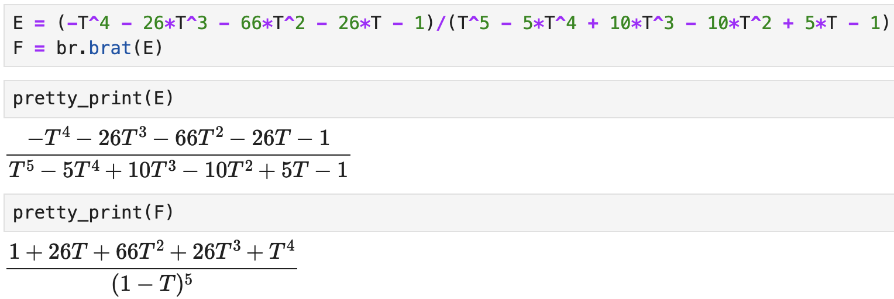

# brat

The class we use to format rational functions is `brat`, and the kinds of rational functions accepted can be expressed as 
\[ 
	\dfrac{F(\bm{X})}{C\bm{X}^{\beta} \prod_{i=1}^m(1 - \bm{X}^{\alpha_i})}, 
\] 

where the following hold:

- $\bm{X}=(X_1, \dots, X_n)$ are variables,
- $F(\bm{X})\in \mathbb{Z}[\bm{X}]$,
- $C\in \N$, 
- $\beta\in\N_0^n$,
- $m\in\N_0$, 
- $\alpha_i\in\mathbb{Z}^n$, where $\bm{X}^{\alpha_i} = X_1^{\alpha_{i,1}}\cdots X_n^{\alpha_{i,n}}$.


The keyword arguments for `brat` are

- `rational_expression`: the rational function (default: `None`),
- `numerator`: the numerator polynomial of the rational function (default: `None`),
- `denominator`: the denominator polynomial of the rational function (default: `None`),
- `denominator_signature`: the dictionary of data for the denominator (default: `None`),
- `fix_denominator`: whether to keep the given denominator fixed---does not apply to coefficients (default: `True`),
- `increasing_order`: whether to display polynomials in increasing degree (default: `True`),
- `hide_monomial`: whether to absorb the monomial in the denominator into the numerator (default: `True`).

*Additional notes*. The `denominator_signature` must be a dictionary whose keys are 
- `"coefficient"`: an integer,
- `"monomial"`: a tuple of non-negative integers with length matching the number of variables,
- `"factors"`: a dictionary whose keys are tuples of integers with values of non-negative integers.

Examples of acceptable `denominator_signature` are given in [Example 3](#example-3) and in the [denominator_signature](brat-methods.md#denominator_signature) method.

## Algebraic operations and relations

One can use the usual algebraic operations with `brat`: add, subtract, multiply, divide (i.e. 'true' divide), powers. The Boolean relations `==` and `!=` can also be used. When adding a `brat` with something else, we attempt to make another `brat` object. To "opt out", use the method `rational_function`. 

**Warning:** we cannot do anything about algebraic operations where the first object is *not* a `brat` object. For example, if `F` is a `brat` but `G` is a polynomial in SageMath, then `G + F` may raise errors, while `F + G` will attempt to add the two objects&mdash;other errors may arise.

---

## Example 1

We expression the rational function
\[
	f(x,y)=\dfrac{1 + xy + x^2y^2}{(1 - x)(1 - y)}.
\]
First we write this in the usual way, using symbolic variables. 

```python
sage: x, y = var('x y')
sage: f = (1 + x*y + x^2*y^2)/((1 - x)*(1 - y))
sage: f
(x^2*y^2 + x*y + 1)/((x - 1)*(y - 1))
```

Now we build a `brat` from $f(x,y)$.
```python
sage: F = br.brat(f)
sage: F
(1 + x*y + x^2*y^2)/((1 - y)*(1 - x))
```

## Example 2

Now we write the rational function 
\[
	g(t) = \dfrac{1 + 4t + 6t^2 + 4t^3 + t^4}{(1 - t)(1 - t^2)(1 - t^3)(1 - t^4)} . 
\]

```python
sage: t = polygens(QQ, 't')[0]
sage: g = (1 + 4*t + 6*t^2 + 4*t^3 + t^4)/((1 - t)*(1 - t^2)*(1 - t^3)*(1 - t^4))
sage: g
(t^2 + 2*t + 1)/(t^8 - 3*t^7 + 4*t^6 - 5*t^5 + 6*t^4 - 5*t^3 + 4*t^2 - 3*t + 1)
```

Now we build a brat. 

```python
sage: G = br.brat(g)
sage: G
(1 + 2*t - 2*t^3 - t^4)/((1 - t)^3*(1 - t^3)*(1 - t^4))
```

We could instead insist that the denominator $(1 - t)(1 - t^2)(1 - t^3)(1 - t^4)$ stay fixed. 
```python
sage: G = br.brat(
	numerator=1 + 4*t + 6*t^2 + 4*t^3 + t^4,
	denominator=(1 - t)*(1 - t^2)*(1 - t^3)*(1 - t^4)
)
sage: G
(1 + 4*t + 6*t^2 + 4*t^3 + t^4)/((1 - t)*(1 - t^2)*(1 - t^3)*(1 - t^4))
```

By default, `fix_denominator` is set to `True`. Setting this to `False` yields the following.
```python
sage: br.brat(
	numerator=1 + 4*t + 6*t^2 + 4*t^3 + t^4,
	denominator=(1 - t)*(1 - t^2)*(1 - t^3)*(1 - t^4),
	fix_denominator=False
)
(1 + 2*t - 2*t^3 - t^4)/((1 - t)^3*(1 - t^3)*(1 - t^4))
```

## Example 3

We construct the following rational function using a signature:
\[
	h = \dfrac{1}{(1 - X_1)(1 - X_2)^3(1 - X_1X_2X_3)^4(1 - X_1X_2X_3^2)}.
\]

```python
sage: R = PolynomialRing(QQ, 'X1,X2,X3')
sage: H = br.brat(
	numerator=R(1),
	denominator_signature={
		(1, 0, 0): 1, 
		(0, 1, 0): 3,
		(1, 1, 1): 4,
		(1, 1, 2): 1
	}
)
sage: H
1/((1 - X1)*(1 - X2)^3*(1 - X1*X2*X3)^4*(1 - X1*X2*X3^2))
```

We can also make the monomial in the signature explicit (and different from $1$).
```python
sage: H = br.brat(
	numerator=R(1),
	denominator_signature={
		"monomial": 3,
		"factors": {
			(1, 0, 0): 1, 
			(0, 1, 0): 3,
			(1, 1, 1): 4,
			(1, 1, 2): 1
		}
	}
)
sage: H
1/(3*(1 - X1)*(1 - X2)^3*(1 - X1*X2*X3)^4*(1 - X1*X2*X3^2))
```

## Example 4

We construct the following rational function a few different ways:
\[ 
	P(T) = \dfrac{1 + 6T + 11T^2 + 6T^3}{(1 - T^4)}. 
\]

```python
sage: T = polygens(QQ, 'T')[0]
sage: P = br.brat((1 + 6*T + 11*T^2 + 6*T^3)/(1 - T^4))
sage: P
(1 + 5*T + 5*T^2 - 5*T^3 - 6*T^4)/((1 - T)*(1 - T^4))
```

By doing the above construction, we added a factor of $1-T$. This is because SageMath automatically removes common factors in the numerator and denominator of the quotient `(1 + 6*T + 11*T^2 + 6*T^3)/(1 - T^4)`. The resulting denominator is $(T - 1)(T^2 + 1)$.

```python
sage: P = br.brat(
	numerator=1 + 6*T + 11*T^2 + 6*T^3,
	denominator=(1 - T)^4
)
sage: P
(1 + 6*T + 11*T^2 + 6*T^3)/(1 - T)^4
```

By separating the denominator (and fixing it by default), we get the desired expression. 

We can also switch the order of how polynomials are displayed. Instead of displaying the terms in a weakly increasing-degree sequence, we can make it weakly decreasing.
```python
sage: P = br.brat(
	numerator=1 + 6*T + 11*T^2 + 6*T^3,
	denominator=(1 - T)^4,
	increasing_order=False
)
sage: P
(6*T^3 + 11*T^2 + 6*T + 1)/(1 - T)^4
```

## Example (pretty_print)

When applying the SageMath function `pretty_print` (or when it is on) in a Jupyter notebook, the brat will be displayed with $\LaTeX$.

There are many ways to set up a Jupyter notebook. One way is to run the following.
```bash
$ sage -n jupyter
```

In our Jupyter notebook, we observe the following.
